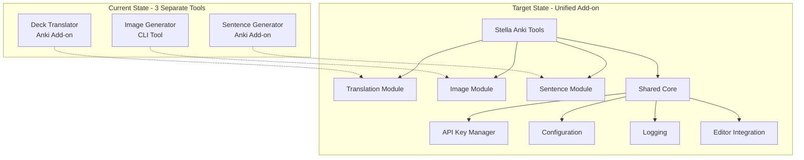
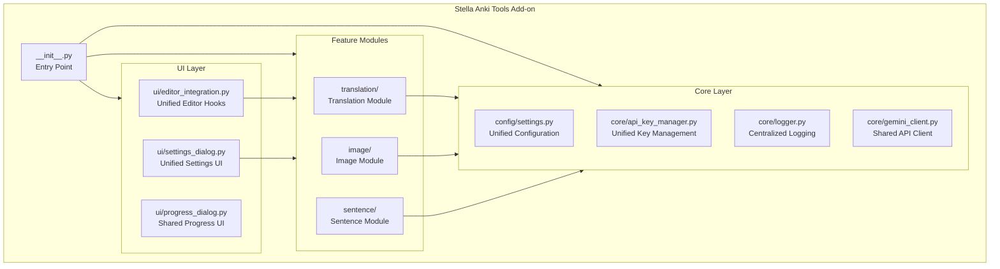

# Stella Anki Tools - Comprehensive Code Analysis

## Executive Summary

This document provides a thorough technical analysis of three Anki tools:
1. **Stella Anki Translator** - AI-powered context-aware vocabulary translator
2. **Anki Image Generator** - AI image generation using Google Gemini/Imagen
3. **BunAI Sentence Generator** - AI-powered example sentence generator

The goal is to combine these into a single, unified Anki add-on called **Stella Anki Tools**.

---

## Architecture Overview



---

## Tool 1: Stella Anki Translator

### Overview
| Property | Value |
|----------|-------|
| **Type** | Anki Add-on |
| **License** | CC BY-NC-SA 4.0 |
| **API** | Google Gemini 2.5 Flash |
| **Anki Version** | 2.1+ (min_point_version: 40) |

### Core Functionality
- Translates vocabulary cards using AI-powered context understanding
- Uses the "Back" (Definition) field to understand word context
- Generates accurate translations based on inferred meaning

### File Structure

```
Anki_Deck_Translater/
├── __init__.py              # Entry point - initializes StellaAnkiTranslater & EditorIntegration
├── stella_translater.py     # Main GUI (1928 lines) - Settings, Tabs, UI
├── api_key_manager.py       # Multi-key rotation system (590 lines)
├── batch_translator.py      # Background batch processing (470 lines)
├── stella_generator.py      # AI interaction logic (343 lines)
├── editor_integration.py    # Editor hooks & buttons (401 lines)
├── api_tester.py            # API connection testing
├── env_manager.py           # Environment variable handling
├── logger.py                # Logging system
├── config.json              # User configuration
├── meta.json                # Anki add-on metadata
└── lib/                     # Bundled dependencies
```

### Key Classes & Components

#### `StellaAnkiTranslater` (stella_translater.py)
- Main controller class managing UI and orchestration
- **Methods**: `setup()`, `start_batch_translation()`, `handle_selection()`, field setters
- Creates tabbed settings dialog with General, API Keys, and Advanced tabs

#### `APIKeyManager` (api_key_manager.py)
- Singleton pattern for managing up to 15 API keys
- Features: key rotation, cooldown management, usage statistics
- Persists to `api_keys.json` and `api_stats.json`

#### `BatchTranslationWorker` (batch_translator.py)
- QRunnable-based background worker for batch processing
- Signals: `progress`, `detailed_progress`, `error_detail`, `key_rotated`
- Supports cancellation via threading.Event

#### `StellaGenerator` (stella_generator.py)
- Modern QueryOp pattern for async operations
- Handles single-note translation with retry logic
- Supports multi-key rotation on rate limit errors

#### `EditorIntegration` (editor_integration.py)
- Hooks into Anki's editor for instant translation
- Toolbar button and keyboard shortcuts (`Ctrl+Shift+B`)
- WebView message handling for button clicks

### Configuration Schema

```json
{
  "gemini_api_key": "",
  "language": "Korean",
  "difficulty": "Normal",
  "deck": "",
  "source_field": "",
  "context_field": "",
  "destination_field": "",
  "auto_generate": false,
  "overwrite_existing": false,
  "skip_existing_translations": true,
  "batch_size": 5,
  "batch_delay_seconds": 8,
  "gemini_model": "gemini-2.5-flash",
  "use_multi_key_rotation": true,
  "enable_editor_button": true,
  "shortcut_key": "Ctrl+Shift+B"
}
```

### Strengths
- ✅ Robust multi-key rotation system
- ✅ Modern Anki 25.x API compatibility
- ✅ Comprehensive error handling & retry logic
- ✅ Both batch and single-note processing

### Areas for Improvement
- ⚠️ Large monolithic `stella_translater.py` (1928 lines)
- ⚠️ UI code mixed with business logic

---

## Tool 2: Anki Image Generator

### Overview
| Property | Value |
|----------|-------|
| **Type** | CLI Tool with Streamlit UI |
| **License** | Not specified |
| **APIs** | Google Gemini (prompts) + Imagen (images) |
| **Architecture** | Modular, professional structure |

### Core Functionality
- Extracts words from Anki decks via AnkiConnect
- Generates image prompts using Gemini
- Creates images using Imagen (Nano Banana) API
- Attaches images to Anki cards

### File Structure

```
Anki_Image_Gen_with_Google_Nano_Banana/
├── main_enhanced.py              # Entry point
├── run_enhanced_workflow.py      # Workflow launcher
├── requirements.txt              # Dependencies
├── src/
│   ├── anki_connector.py         # AnkiConnect integration (656 lines)
│   ├── api_key_manager.py        # Encrypted key storage (394 lines)
│   ├── config_manager.py         # Configuration management
│   ├── config_validator.py       # Validation logic
│   ├── core_automation.py        # Main orchestrator (1183 lines)
│   ├── gemini_client.py          # Prompt generation (610 lines)
│   ├── nano_banana_client.py     # Image generation (544 lines)
│   ├── database_manager.py       # SQLite management
│   ├── cost_monitor.py           # API cost tracking
│   ├── cli/                      # CLI interface modules
│   │   ├── workflow_controller.py    # Main workflow (72,565 bytes)
│   │   ├── enhanced_workflow_controller.py
│   │   ├── menu_system.py
│   │   └── cli_interface.py
│   └── ui/                       # Streamlit GUI components
├── config/
│   ├── config.py                 # Static configuration & prompts
│   ├── user_settings.json        # User preferences
│   └── api_keys.enc              # Encrypted API keys
└── data/
    ├── database/                 # SQLite database
    └── images/                   # Generated images
```

### Key Classes & Components

#### `AnkiImageAutomation` (core_automation.py)
- Main orchestrator for end-to-end workflow
- **Methods**: `extract_words_from_deck()`, `generate_prompts_for_words()`, `generate_images_from_prompts()`
- Coordinates Gemini, Imagen, and AnkiConnect interactions

#### `GeminiClient` (gemini_client.py)
- Generates descriptive image prompts for words
- Uses new Google Gen AI SDK (`google-genai>=1.0.0`)
- Batch processing support (20-30 words per request)

#### `NanoBananaClient` (nano_banana_client.py)
- Image generation via Gemini 2.5 Flash Image model
- Image resizing/optimization for Anki
- Batch processing with rate limiting

#### `AnkiConnector` (anki_connector.py)
- Complete AnkiConnect API integration
- **Methods**: `find_notes_without_images()`, `store_media_file()`, `add_image_to_note()`
- Handles media encoding and field updates

#### `APIKeyManager` (api_key_manager.py)
- Encrypted key storage using Fernet
- Key rotation and failure tracking
- Usage statistics and cooldown management

### Dependencies

```
streamlit>=1.28.0
requests>=2.31.0
google-genai>=1.0.0
Pillow>=10.0.0
pandas>=2.0.0
cryptography>=41.0.0
colorama>=0.4.6
rich>=13.0.0
tqdm>=4.64.0
tenacity>=8.2.0
```

### Master Prompt System

The tool includes a sophisticated prompt templating system:

```python
UNIFIED_PROMPT = {
    "name": "Unified Image Generation Prompt",
    "content": """Create a detailed, vivid, and educational scene description...
    **Style Requirements:**
    - Beautiful anime style with vibrant colors
    - High-quality digital art with clean line art
    - If a person is needed, use a cute young female anime character
    ..."""
}
```

### Strengths
- ✅ Clean modular architecture with separation of concerns
- ✅ Encrypted API key storage
- ✅ Database-backed workflow state
- ✅ Comprehensive test suite
- ✅ Uses latest Google Gen AI SDK

### Conversion Challenges for Add-on
- ⚠️ Uses AnkiConnect (HTTP) instead of direct Anki API
- ⚠️ Heavy external dependencies (Streamlit, pandas, etc.)
- ⚠️ File-based operations need adaptation for add-on context
- ⚠️ Relies on `google-genai` SDK (different from `google-generativeai`)

---

## Tool 3: BunAI Sentence Generator

### Overview
| Property | Value |
|----------|-------|
| **Type** | Anki Add-on |
| **License** | AGPL-3.0 |
| **API** | Google Gemini |
| **Anki Version** | 2.1+ (min_point_version: 40) |

### Core Functionality
- Generates example sentences for vocabulary words
- Creates sentence + translation pairs
- Progress tracking with resume capability

### File Structure

```
Anki_Sentence_generater/
├── __init__.py              # Entry point - initializes BunAI & EditorIntegration
├── bunai.py                 # Main GUI (905 lines)
├── sentence_generator_modern.py  # QueryOp-based generator (451 lines)
├── sentence_worker.py       # QRunnable worker (259 lines)
├── editor_integration.py    # Editor hooks (410 lines)
├── progress_state.py        # Resume/state management
├── api_tester.py            # API testing
├── logger.py                # Logging system
├── debug_utils.py           # Debug utilities
├── config.json              # User configuration
└── meta.json                # Anki add-on metadata
```

### Key Classes & Components

#### `BunAI` (bunai.py)
- Main controller class with UI setup
- **Methods**: `popup_generate_window()`, `_process_notes_sequentially()`
- Progress dialog with real-time updates and error tracking

#### `SentenceGenerator` (sentence_generator_modern.py)
- Modern QueryOp pattern for async operations
- JSON response parsing with repair logic
- Word highlighting in generated sentences

#### `SentenceWorker` (sentence_worker.py)
- QRunnable-based background worker
- BeautifulSoup for HTML processing
- Signals for completion and errors

#### `EditorIntegration` (editor_integration.py)
- Similar structure to Translator's editor integration
- Toolbar button and `Ctrl+Shift+B` shortcut
- Auto-generate on field focus change

#### `ProgressStateManager` (progress_state.py)
- Persists processing state for resume capability
- Tracks which cards have been processed
- Enables recovery from interruptions

### Configuration Schema

```json
{
  "gemini_api_key": "",
  "language": "English",
  "difficulty": "Normal",
  "deck": "",
  "sentence_field": "",
  "translation_field": "",
  "expression_field": "",
  "auto_generate": false,
  "enable_editor_button": true,
  "shortcut_key": "Ctrl+Shift+B"
}
```

### Prompt Strategy

```python
def _create_prompt(self, target_word: str, difficulty: str, language: str) -> str:
    return f"""Generate an example sentence using "{target_word}"...
    Difficulty: {difficulty}
    Return JSON: {{"sentence": "...", "translation": "..."}}"""
```

### Strengths
- ✅ Progress tracking with resume capability
- ✅ Real-time progress UI with ETA
- ✅ JSON response repair for malformed responses
- ✅ Word highlighting in sentences

### Areas for Improvement
- ⚠️ Lacks multi-key rotation (single API key only)
- ⚠️ Similar code duplication with Translator

---

## Cross-Tool Comparison

### Component Matrix

| Component | Translator | Image Gen | Sentence Gen |
|-----------|:----------:|:---------:|:------------:|
| **API Key Manager** | ✅ Multi-key | ✅ Encrypted | ❌ Single key |
| **Editor Integration** | ✅ | ❌ CLI | ✅ |
| **Batch Processing** | ✅ | ✅ | ✅ |
| **Progress Tracking** | ✅ | ✅ | ✅ Enhanced |
| **Resume Capability** | ❌ | ✅ DB | ✅ JSON |
| **Config System** | Anki + JSON | .env + JSON | Anki + JSON |
| **Async Pattern** | QueryOp | Threading | QueryOp |
| **AnkiConnect** | ❌ Direct | ✅ HTTP | ❌ Direct |

### Keyboard Shortcut Conflicts

> [!WARNING]
> Both Translator and Sentence Generator use `Ctrl+Shift+B` as default shortcut!

**Resolution**: Unified add-on should use distinct shortcuts:
- Translation: `Ctrl+Shift+T`
- Sentence: `Ctrl+Shift+S`
- Image: `Ctrl+Shift+I`

### API Key Management Comparison

| Feature | Translator | Image Gen |
|---------|-----------|-----------|
| Max Keys | 15 | Unlimited |
| Storage | JSON files | Fernet encrypted |
| Rotation | Automatic on 429 | Manual selection |
| Stats | ✅ Per-key | ✅ Per-key |
| Cooldown | 24hr automatic | Manual reset |

**Recommendation**: Merge approaches - use encrypted storage with automatic rotation.

### Logging Comparison

```python
# Translator/Sentence Generator Pattern
class StellaLogger:
    def __init__(self, addon_dir):
        self.log_file = os.path.join(addon_dir, 'logs', 'stella.log')
        
# Image Generator Pattern
logging.basicConfig(level=logging.INFO)
logger = logging.getLogger(__name__)
```

**Recommendation**: Standardize on Python logging with file rotation.

---

## Integration Architecture Recommendation



### Proposed Directory Structure

```
stella_anki_tools/
├── __init__.py                 # Entry point
├── manifest.json               # Anki add-on manifest
├── config.json                 # Default configuration
├── core/
│   ├── __init__.py
│   ├── api_key_manager.py      # Unified multi-key system (from Translator)
│   ├── gemini_client.py        # Shared Gemini interface
│   ├── logger.py               # Centralized logging
│   └── base_generator.py       # Abstract base for generators
├── config/
│   ├── __init__.py
│   ├── settings.py             # Configuration management
│   └── prompts.py              # Master prompts for all features
├── translation/
│   ├── __init__.py
│   ├── translator.py           # Translation logic
│   └── batch_translator.py     # Batch processing
├── image/
│   ├── __init__.py
│   ├── prompt_generator.py     # Image prompt creation
│   ├── image_generator.py      # Imagen API client
│   └── anki_media.py           # Media management
├── sentence/
│   ├── __init__.py
│   ├── sentence_generator.py   # Sentence generation
│   └── progress_state.py       # Resume capability
├── ui/
│   ├── __init__.py
│   ├── main_window.py          # Unified settings dialog
│   ├── editor_integration.py   # Unified editor hooks
│   ├── progress_dialog.py      # Shared progress UI
│   └── widgets/                # Reusable UI components
└── lib/                        # Bundled dependencies
```

---

## Technical Debt & Refactoring Opportunities

### 1. Code Deduplication

**Common patterns that can be unified:**

```python
# Pattern: HTML Text Extraction (appears in all 3 tools)
def _extract_clean_text(html_content: str) -> str:
    if not html_content:
        return ""
    clean = re.sub('<[^<]+?>', '', html_content)
    return clean.strip()

# Pattern: API Error Classification
def _classify_error(error: Exception) -> str:
    error_str = str(error).lower()
    if "429" in error_str or "quota" in error_str:
        return "rate_limit"
    elif "invalid" in error_str:
        return "invalid_request"
    # ...
```

### 2. Configuration Consolidation

**Current State**: Three separate config schemas

```json
// Proposed Unified Schema
{
  "version": "1.0.0",
  "api": {
    "keys": [],
    "rotation_enabled": true,
    "cooldown_hours": 24,
    "model": "gemini-2.5-flash"
  },
  "translation": {
    "enabled": true,
    "language": "Korean",
    "source_field": "Word",
    "context_field": "Definition",
    "destination_field": "Translation"
  },
  "image": {
    "enabled": true,
    "word_field": "Word",
    "image_field": "Image",
    "style_preset": "anime"
  },
  "sentence": {
    "enabled": true,
    "expression_field": "Word",
    "sentence_field": "Sentence",
    "translation_field": "SentenceTranslation",
    "difficulty": "Normal"
  },
  "editor": {
    "buttons_enabled": true,
    "shortcuts": {
      "translate": "Ctrl+Shift+T",
      "sentence": "Ctrl+Shift+S",
      "image": "Ctrl+Shift+I"
    }
  }
}
```

### 3. Image Generator Adaptation

**Key Changes Required:**

| CLI Component | Add-on Adaptation |
|--------------|-------------------|
| AnkiConnect HTTP | Direct `mw.col` API |
| File-based images | `mw.col.media` storage |
| SQLite persistence | Anki config/meta.json |
| Streamlit UI | Qt-based dialogs |
| `google-genai` SDK | `google-generativeai` (or bundle genai) |

---

## Dependency Analysis

### Required Bundled Libraries

```
# Already bundled in existing add-ons
google-generativeai  # For Gemini API

# Needed for Image Generator
Pillow               # Image processing (likely already available in Anki)
cryptography         # For encrypted key storage (optional)

# NOT needed (remove from Image Gen CLI deps)
streamlit           # CLI/Web UI only
pandas              # Not needed for add-on
colorama/rich/tqdm  # CLI aesthetics only
```

### SDK Migration Note

> [!IMPORTANT]
> The Image Generator uses `google-genai` SDK while the other tools use `google-generativeai`. These are different packages:
> - `google-generativeai` - Current stable SDK
> - `google-genai` - Newer unified SDK (post-2024)
> 
> **Recommendation**: Standardize on `google-generativeai` for consistency, or bundle `google-genai` if Imagen features require it.

---

## Conclusion

The three tools share significant common ground in their architecture and can be efficiently combined into a unified add-on. Key benefits of integration:

1. **Unified API Key Management** - Users configure keys once
2. **Consistent User Experience** - Single settings dialog
3. **Reduced Footprint** - Shared core components
4. **Better Maintainability** - Centralized codebase
5. **Enhanced Features** - Cross-feature workflows (e.g., generate sentence + image together)

The primary challenge is adapting the CLI-based Image Generator to work within the Anki add-on environment, which requires replacing AnkiConnect calls with direct Anki API usage.
